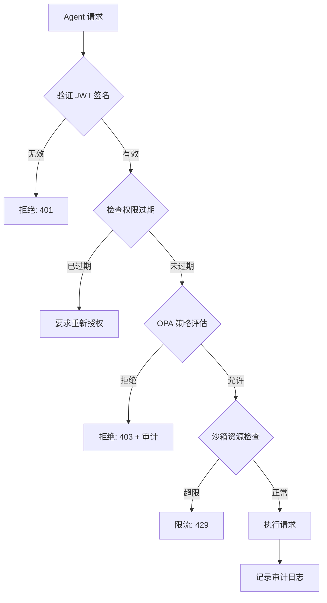

# OpenClaw Agent 权限开放方案调研报告

**调研日期**：2026-02-07
**调研目的**：为 OpenClaw 官网、社区、平台设计安全的 agent 权限开放方案
**调研范围**：当前架构分析、2026 年行业最佳实践、多 Agent 安全框架

---

## 一、当前架构分析

### 1.1 现有权限机制

OpenClaw 已实现以下安全层：

| 权限类型 | 当前实现 | 文件位置 |
|---------|---------|---------|
| **文件系统** | 白名单限制：`[WORKSPACE]`, `/tmp` | [AGENTS.md](../AGENTS.md) |
| **网络访问** | API 端点白名单 | [AGENTS.md](../AGENTS.md) |
| **命令执行** | 仅允许 `node`, `python3`, `bash` | [AGENTS.md](../AGENTS.md) |
| **沙箱隔离** | 环境变量 + 工作目录隔离 | [AGENTS.md](../AGENTS.md) |
| **会话初始化** | 强制读取核心配置文件 | [AGENTS.md](../AGENTS.md) |

### 1.2 三级权限边界

```markdown
✅ 自动执行（内部权限）
- 读取工作区所有文件
- 网络搜索（Tavily API）
- 编写和更新文档
- 重构和优化代码

⚠️ 需要确认（边界权限）
- 发送邮件或消息
- 发布到社交媒体或公开平台
- 修改系统配置
- 访问工作区之外的文件

❌ 绝对禁止（安全红线）
- 泄露私人信息
- 在群聊中假装是用户
- 执行破坏性命令
- 访问敏感系统区域
```

---

## 二、2026 年行业最佳实践

### 2.1 核心安全原则

根据最新研究，以下原则被广泛采用：

1. **最小权限原则**
   - 仅授予完成任务所需的最低权限
   - 参考：[Salesforce Best Practices](https://help.salesforce.com/s/articleView?id=ai.agent_user.htm)

2. **动态授权**（Context-Aware ABAC）
   - 基于 agent 身份 + 用户身份 + 时间 + 上下文动态决策
   - 参考：[Oso HQ Best Practices](https://www.osohq.com/learn/best-practices-of-authorizing-ai-agents)

3. **时限权限**
   - 权限应自动过期，需要重新授权
   - 参考：[Curity User Consent Guide](https://curity.io/blog/user-consent-best-practices-in-the-age-of-ai-agents/)

4. **细粒度同意**
   - 用户明确授权每个操作类别
   - 数据：[Gravitee 2026 Report](https://www.gravitee.io/blog/state-of-ai-agent-security-2026-report) - 仅 14.4% 的团队有完整安全审批

### 2.2 多 Agent 权限委托框架

最新研究推荐的架构模式：

| 框架类型 | 关键特性 | 来源 |
|---------|---------|------|
| **认证委托** | 使用委托令牌链验证权限传递 | [Securing Agentic Systems](https://dev.to/uenyioha/securing-agentic-systems-with-authenticated-delegation-part-i-3g40) |
| **联邦身份** | OAuth 2.0 / SAML 跨域权限 | [Tencent Cloud Techpedia](https://www.tencentcloud.com/techpedia/126745) |
| **A2A 扫描** | Cisco 开源 Agent-to-Agent 安全扫描器 | [Cisco A2A Scanner](https://blogs.cisco.com/ai/securing-ai-agents-with-ciscos-open-source-a2a-scanner) |
| **安全编排** | 多 Agent 协调的安全框架 | [ArXiv 2025 论文](https://arxiv.org/html/2511.21990v1) |

---

## 三、官网、社区、平台权限开放方案

### 3.1 分层权限架构

```
┌─────────────────────────────────────────────────┐
│                  官网层                          │
│  • 公开文档访问 (read-only)                      │
│  • 技能商店浏览 (catalog-only)                   │
│  • Agent 模板展示 (template-only)                │
└────────────────┬────────────────────────────────┘
                 │
┌────────────────▼────────────────────────────────┐
│                  社区层                          │
│  • GitHub OAuth 认证                             │
│  • ClawHub 技能分享 (code-review + sandbox)      │
│  • Agent 配置分享 (sanitized configs)            │
│  • 论坛讨论 (moderated)                          │
└────────────────┬────────────────────────────────┘
                 │
┌────────────────▼────────────────────────────────┐
│                 平台层                           │
│  • API Gateway (18789) + 权限验证                │
│  • Agent 执行环境 (sandboxed)                    │
│  • 权限委托链 (delegation tokens)                │
│  • 审计日志 (audit trails)                      │
└────────────────┬────────────────────────────────┘
                 │
┌────────────────▼────────────────────────────────┐
│               核心层                             │
│  • 用户数据 (encrypted + isolated)               │
│  • API Keys (HSM / secret manager)              │
│  • Agent 配置 (SOUL.md, USER.md, etc.)          │
└─────────────────────────────────────────────────┘
```

### 3.2 具体实施方案

#### **A. 官网**

| 功能 | 权限级别 | 实现方式 |
|------|---------|---------|
| **文档浏览** | 公开 | Static Site + CDN |
| **Agent 展示** | 只读 | 配置模板脱敏展示 |
| **技能商店** | 浏览 | ClawHub catalog API |
| **教程/指南** | 公开 | Markdown → 静态页面 |

**安全考虑**：
- 不得暴露用户真实路径（`/Users/lijian/clawd` → `[WORKSPACE]`）
- API Key 使用占位符（`tvly-dev-***` → `YOUR_TAVILY_API_KEY`）
- 配置文件中敏感信息替换为环境变量

**配置脱敏示例**：

```bash
# 原始配置 (AGENTS.md)
network:
  allowed:
    - api.openai.com
    - api.moonshot.cn
filesystem:
  read:
    - /Users/lijian/clawd

# 脱敏后 (官网展示)
network:
  allowed:
    - api.openai.com
    - api.moonshot.cn
filesystem:
  read:
    - [WORKSPACE]
    - [TEMP_DIR]
```

#### **B. 社区**

| 功能 | 权限级别 | 实现方式 |
|------|---------|---------|
| **GitHub 登录** | OAuth 2.0 | [GitHub OAuth App](https://docs.github.com/en/developers/apps/building-oauth-apps) |
| **技能分享** | Code Review | 自动扫描 + 人工审查 + A2A 扫描 |
| **配置分享** | Sanitized | 自动脱敏工具 |
| **Agent 交流** | Moderated | 社区规范 + AI 过滤 |

**权限委托机制**：
```json
{
  "user": "github:123456",
  "agent": "shared-agent-456",
  "permissions": {
    "read": ["public/agents/*"],
    "write": ["users/github:123456/agents/*"],
    "execute": ["sandbox:limited"],
    "delegate": false
  },
  "expiresAt": "2026-02-14T00:00:00Z",
  "auditLog": "https://audit.openclaw.ai/logs/..."
}
```

**安全审查流程**：

1. **自动化扫描**（NVIDIA NeMo Guardrails）
   - 检测 `eval()`, `child_process`, 危险网络调用
   - 参考：[NeMo Guardrails GitHub](https://github.com/NVIDIA-NeMo/Guardrails)

2. **A2A 代理扫描**（Cisco A2A Scanner）
   - Agent 之间的权限传递安全检查
   - 参考：[Cisco A2A Scanner](https://blogs.cisco.com/ai/securing-ai-agents-with-ciscos-open-source-a2a-scanner)

3. **沙箱测试**
   - 在隔离环境中运行 24 小时
   - 监控资源使用和网络行为

4. **社区评级**（A-D 级）
   - A 级：官方认证，完全安全
   - B 级：社区审查通过
   - C 级：基础扫描通过
   - D 级：实验性，风险自负

#### **C. 平台**

| 功能 | 权限级别 | 实现方式 |
|------|---------|---------|
| **Agent 执行** | 沙箱隔离 | Docker 容器 + seccomp |
| **API Gateway** | 委托令牌 | JWT + 签名验证 |
| **权限管理** | RBAC + ABAC | [Open Policy Agent](https://www.openpolicyagent.org/) |
| **审计日志** | 完整追踪 | W3C TRACE 标准 |

**API Gateway 权限验证流程**：



**OPA 策略示例**（Rego 语言）：

```rego
package openclaw.auth

default allow = false

allow {
    # 基础认证
    input.jwt.payload.sub == input.agent_id

    # 权限检查
    input.jwt.payload.permissions[_] == input.action

    # 资源匹配
    input.resource in input.jwt.payload.resources

    # 时间限制
    time.now_ns() < input.jwt.payload.exp

    # 上下文检查
    valid_context(input.context)
}

valid_context(context) {
    # 不允许在非工作时间执行高危操作
    not is_high_risk(context.action)

    # 高危操作需要额外确认
    is_high_risk(context.action)
    context.user_confirmed == true
}

is_high_risk(action) {
    action in ["delete", "deploy", "email", "social_post"]
}
```

### 3.3 ClawHub 技能市场权限设计

**权限分级系统**：

| 等级 | 权限范围 | 审查要求 | 示例 |
|------|---------|---------|------|
| 🟢 **Safe** | 只读 + 本地文件操作 | 自动扫描 | `grep`, `file-reader` |
| 🟡 **Limited** | 受限网络 + 沙箱命令 | 人工审查 | `tavily-search`, `bark-push` |
| 🟠 **Elevated** | 完整网络访问 + API 调用 | 深度审查 | `github-deploy`, `slack-integration` |
| 🔴 **Critical** | 文件写入 + 系统配置 | 官方认证 | `system-config`, `database-migration` |

**技能安装权限请求流程**：

```
用户尝试安装 "github-deploy" 技能
         ↓
    显示权限清单
    • 读取 Git 配置
    • 推送到 GitHub
    • 访问 workspace 文件
         ↓
    用户同意（可选择临时/永久）
         ↓
    生成权限令牌（24小时/30天）
         ↓
    技能安装到沙箱环境
         ↓
    审计日志记录
```

---

## 四、实施路线图

### 阶段 1：官网公开化（1-2 周）
- [ ] 创建静态网站生成器配置
- [ ] 脱敏处理配置文件（路径、API Key）
- [ ] 编写 Agent 模板展示页面
- [ ] 发布文档到公开 CDN

### 阶段 2：社区建设（2-4 周）
- [ ] 集成 GitHub OAuth 认证
- [ ] 搭建 ClawHub 技能市场
- [ ] 实现配置自动脱敏工具
- [ ] 集成 NeMo Guardrails 扫描
- [ ] 建立社区审查流程

### 阶段 3：平台开放（4-8 周）
- [ ] 实现 API Gateway 权限验证
- [ ] 集成 Open Policy Agent
- [ ] 搭建沙箱执行环境
- [ ] 实现审计日志系统
- [ ] 建立权限委托链机制

### 阶段 4：生态完善（持续）
- [ ] A2A 安全扫描集成
- [ ] 技能评级系统优化
- [ ] 社区治理机制
- [ ] 安全事件响应流程

---

## 五、关键技术栈推荐

| 功能 | 开源方案 | 商业方案 | 推荐指数 |
|------|---------|---------|---------|
| **API Gateway** | Kong, KrakenD | Gravitee, AWS API Gateway | ⭐⭐⭐⭐⭐ |
| **权限引擎** | Open Policy Agent | Oso, Cerberos | ⭐⭐⭐⭐⭐ |
| **安全扫描** | NeMo Guardrails | Snyk, Veracode | ⭐⭐⭐⭐ |
| **沙箱隔离** | Docker gVisor, Firecracker | AWS Lambda, Google Cloud Run | ⭐⭐⭐⭐⭐ |
| **密钥管理** | HashiCorp Vault | AWS Secrets Manager, Azure Key Vault | ⭐⭐⭐⭐ |
| **审计日志** | Elasticsearch + Kibana | Datadog, Splunk | ⭐⭐⭐⭐ |
| **身份认证** | Keycloak | Auth0, Okta | ⭐⭐⭐⭐ |

**推荐组合**：
- **小型社区**：Kong + OPA + Docker
- **中型平台**：Kong + OPA + gVisor + Vault
- **大型生态**：Gravitee + Oso + Firecracker + Vault + Datadog

---

## 六、风险评估与缓解

| 风险 | 等级 | 概率 | 影响 | 缓解措施 |
|------|------|------|------|---------|
| **权限提升攻击** | 🔴 高 | 中 | 严重 | 最小权限原则 + OPA 实时验证 |
| **供应链污染** | 🟠 中 | 低 | 严重 | 强制代码审查 + 沙箱测试 |
| **密钥泄露** | 🔴 高 | 低 | 严重 | 密钥不存储在 Agent 配置中，使用 HSM |
| **越界访问** | 🟠 中 | 中 | 中等 | 沙箱文件系统 + 网络白名单 |
| **DDoS 攻击** | 🟡 低 | 高 | 轻微 | API 限流 + CDN 防护 |
| **配置脱敏遗漏** | 🟠 中 | 中 | 中等 | 自动化扫描工具 + 人工审查 |

---

## 七、立即可实施的改进

### 7.1 配置脱敏工具

创建 `scripts/sanitize-config.sh`：

```bash
#!/bin/bash
# OpenClaw 配置脱敏工具

sanitize_config() {
    local input_file="$1"
    local output_file="${input_file%.md}-sanitized.md"

    sed -E '
        # 替换用户路径
        s|/Users/[^/]+/clawd|[WORKSPACE]|g
        s|/Users/[^/]+/|\[USER_HOME]/|g

        # 替换 API Keys
        s|tvly-dev-[A-Za-z0-9]+|YOUR_TAVILY_API_KEY|g
        s|sk-[a-zA-Z0-9]+|YOUR_API_KEY|g
        s|bearer [A-Za-z0-9]+|bearer YOUR_TOKEN|g

        # 替换邮箱
        s|[a-zA-Z0-9._%+-]+@[a-zA-Z0-9.-]+\.[a-zA-Z]{2,}|YOUR_EMAIL@example.com|g

        # 替换 IP 地址
        s|[0-9]{1,3}\.[0-9]{1,3}\.[0-9]{1,3}\.[0-9]{1,3}|YOUR_IP_ADDRESS|g
    ' "$input_file" > "$output_file"

    echo "✅ 脱敏配置已生成: $output_file"
}

# 使用示例
sanitize_config "AGENTS.md"
```

### 7.2 权限清单模板

创建 `docs/PERMISSION-MANIFEST-TEMPLATE.md`：

```markdown
# Agent 权限清单

## 基本信息
- **Agent 名称**：example-agent
- **版本**：1.0.0
- **作者**：your-name
- **评级**：🟢 Safe / 🟡 Limited / 🟠 Elevated / 🔴 Critical

## 权限请求

### 文件系统
- [ ] 读取：`[WORKSPACE]`
- [ ] 写入：`[WORKSPACE]/output`
- [ ] 删除：无

### 网络访问
- [ ] 允许域名：`api.example.com`
- [ ] 协议：HTTPS
- [ ] 端口：443

### 命令执行
- [ ] 允许命令：`node`, `bash`
- [ ] 受限参数：仅允许特定参数

### 数据访问
- [ ] 读取用户数据：否
- [ ] 修改配置：否
- [ ] 访问敏感信息：否

## 使用场景
本 Agent 用于 [描述具体用途]

## 风险评估
- **潜在风险**：[描述]
- **缓解措施**：[描述]
- **审计建议**：[描述]

## 审查记录
- **自动扫描**：✅ 通过
- **人工审查**：⏳ 待审查
- **沙箱测试**：⏳ 待测试
```

---

## 八、总结与建议

### 核心建议

1. **渐进式开放**：从只读文档开始，逐步开放技能分享和平台访问
2. **安全优先**：每个层级都要有独立的权限验证和审计机制
3. **社区共治**：建立透明审查流程和社区评级系统
4. **标准化**：遵循 OAuth 2.0、OpenID Connect、W3C TRACE 等标准
5. **可审计性**：所有权限委托和执行都记录完整审计日志

### OpenClaw 已有优势

- ✅ 白名单权限控制
- ✅ 三级安全边界（自动/确认/禁止）
- ✅ 沙箱隔离机制
- ✅ 配置文件分离（SOUL.md, USER.md, AGENTS.md）
- ✅ 技能安全审查指南（SKILL-SECURITY-GUIDE.md）

### 建议下一步行动

1. **立即行动**：
   - 创建配置脱敏脚本
   - 编写技能提交模板
   - 选择 API Gateway 方案（推荐 Kong + OPA）

2. **短期规划**（1-2周）：
   - 设计官网静态站点
   - 创建公开文档版本

3. **中期规划**（1个月）：
   - 搭建 GitHub OAuth 认证
   - 实现 ClawHub MVP

4. **长期愿景**（3个月）：
   - 完整的平台开放
   - 社区生态成熟

---

## 九、参考资料

### 最佳实践
- [4 Best AI Agent Authentication Platforms 2026](https://dev.to/composiodev/4-best-ai-agent-authentication-platforms-to-consider-in-2026-32o8)
- [State of AI Agent Security 2026 Report](https://www.gravitee.io/blog/state-of-ai-agent-security-2026-report-when-adoption-outpaces-control)
- [Best Practices of Authorizing AI Agents](https://www.osohq.com/learn/best-practices-of-authorizing-ai-agents)
- [5 Best Practices for AI Agent Access Control](https://prefactor.tech/blog/5-best-practices-for-ai-agent-access-control)
- [User Consent Best Practices in AI Agents](https://curity.io/blog/user-consent-best-practices-in-the-age-of-ai-agents/)

### 多 Agent 安全框架
- [A Safety and Security Framework for Real-World Agentic Systems](https://arxiv.org/html/2511.21990v1)
- [Securing Agentic Systems with Authenticated Delegation](https://dev.to/uenyioha/securing-agentic-systems-with-authenticated-delegation-part-i-3g40)
- [A New Identity Framework for AI Agents](https://community.cisco.com/t5/security-blogs/a-new-identity-framework-for-ai-agents/ba-p/5294337)
- [AI Agent Permissions: Delegated Access](https://www.osohq.com/learn/ai-agent-permissions-delegated-access)
- [How to manage permissions in multi-agent collaboration](https://www.tencentcloud.com/techpedia/126745)

### 开源工具
- [Cisco A2A Scanner](https://blogs.cisco.com/ai/securing-ai-agents-with-ciscos-open-source-a2a-scanner)
- [NVIDIA NeMo Guardrails](https://github.com/NVIDIA-NeMo/Guardrails)
- [AgentGateway](https://agentgateway.dev/)
- [8 API Security Best Practices For AI Agents](https://curity.io/resources/learn/api-security-best-practice-for-ai-agents/)
- [Building a Secure API Gateway for AI Agents](https://medium.com/@connect.hashblock/building-a-secure-api-gateway-for-ai-agents-with-oauth-rate-limits-and-audit-trails-19926921fd24)

---

**文档版本**：v1.0
**最后更新**：2026-02-07
**建议审查周期**：每月更新（AI 安全领域快速演进）
