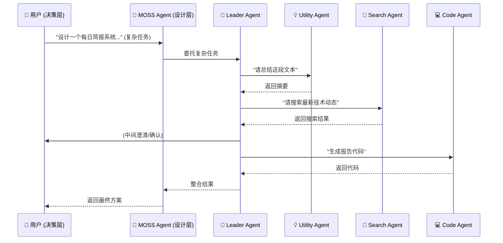

# 设计方案：Multi-Agent Phase 2 - 启用 Leader Agent

> **文档版本**: v1.0
> **创建日期**: 2026-02-07
> **作者**: MOSS
> **状态**: 草案

---

## 1. 愿景与定位

### 1.1. 项目愿景
超越简单的子Agent调用，构建一个具备任务理解、智能分解、调度、监控和结果整合能力的“Leader Agent”，使系统能够处理更宏大、更复杂的任务，提升整体效率和智能化水平。

### 1.2. Leader Agent 定位
- **名称**: `leader-agent`
- **模型**: 默认使用 `Gemini 2.5 Pro` (或同等级别的其他高性能模型)。因为它需要卓越的“思考、规划、推理”能力。
- **核心职责**: 
    1.  **任务理解与分解**: 将用户提出的复杂任务，分解为一系列可由子Agents执行的原子任务或子任务流。
    2.  **子Agent调度**: 根据子任务的性质，智能选择并调度最合适的子Agent（如 `utility-agent`、`search-agent`、`code-agent` 等）进行处理。
    3.  **任务监控**: 跟踪子Agent的执行状态，处理异常。
    4.  **结果整合**: 将多个子Agent的执行结果进行收集、分析、整合，形成最终的用户可见的成果。
    5.  **沟通协调**: 在执行过程中，适时与用户进行澄清、确认和异步汇报。
- **调用方式**: 用户直接与 Leader Agent 对话，或主Agent将复杂任务委托给 Leader Agent。

## 2. 核心技术实现：基于 OpenClaw 的多Agent编排

我们将利用 OpenClaw 的 `sessions_spawn` 和 `sessions_send` 命令，结合我们已有的 `utility-agent` 经验，进行多Agent的编排。

### 2.1. Agent 种类
- **`leader-agent`**: 我们的核心调度Agent，负责高级决策和编排。
- **`utility-agent`**: (已实现) 负责低成本的原子文本处理任务（摘要、翻译、格式转换）。
- **`search-agent`**: (待实现) 专门负责外部信息检索（如网络搜索、文档库搜索）。
- **`code-agent`**: (待实现) 专门负责代码编写、测试和执行（或调用现有技能）。
- **`file-agent`**: (待实现) 专门负责文件系统操作、数据管理。

### 2.2. 交互模式 (概念性)

**关键在于**：Leader Agent 的系统提示词和上下文管理，它将是整个编排的核心。

## 3. 分阶段实施计划 (Phased Implementation)

### **Phase 1 (v1.0): 最小可行产品 (MVP) -> “任务分解与委托”**

**目标**: 成功启动 `leader-agent`，并能接收一个简单任务，将其中的一个子任务委托给 `utility-agent`，并整合结果。

**实施步骤 (草案)**:
1.  **注册 `leader-agent`**: 在 OpenClaw 配置中定义 `leader-agent` 的 Agent ID，并为其永久绑定 `Gemini 2.5 Pro` 模型。
2.  **设计 Leader Agent 的 Prompt**: 初步设计一个系统 Prompt，指导 `leader-agent` 进行任务分解。
3.  **编写 Leader Agent 的执行核心**: 创建一个 `leader-agent-core.js` 或 `run.sh` 脚本，它负责接收任务，并能够调用 `utility-agent.sh`。
4.  **测试流程**: (主Agent) -> `leader-agent` -> `utility-agent` -> 返回结果。

### **Phase 2 (v2.0): 多Agent协同与结果整合 (待规划)**

**目标**: 引入 `search-agent` 等更多专业子Agent，实现 `Leader Agent` 对多个子Agent的并行调度和结果的智能整合。

## 4. 成功衡量标准 (Metrics for Success)

1.  **任务分解的准确性**: `leader-agent` 能将复杂任务分解为合理、可执行的子任务。
2.  **调度效率**: 能准确选择最合适的子Agent，且调用响应时间合理。
3.  **结果整合质量**: 能将来自不同子Agent的结果，清晰、无缝地整合为最终成果。
4.  **资源利用率**: 通过智能调度，实现整体 Token 消耗的最优化。

## 5. 风险评估

-   **任务分解的复杂性**: 自动化任务分解需要强大的推理能力，`leader-agent` 的 Prompt 和逻辑设计至关重要。
-   **Agent 间通信与错误处理**: 如何优雅地处理子Agent执行失败或返回异常结果的情况。
-   **上下文管理**: `Leader Agent` 需要维护整个任务的上下文，并将其传递给子Agents。

---

**下一步**: 等待您的批准，以启动 **Phase 1** 的实施。